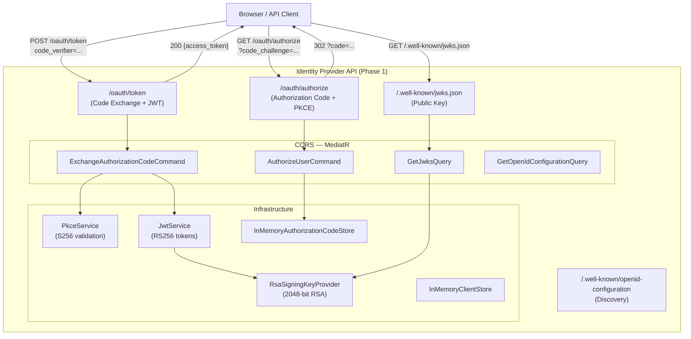

# Secure Identity & Trusted Data API

[](https://dotnet.microsoft.com/)
[](https://learn.microsoft.com/en-us/dotnet/csharp/)
[](LICENSE)

---

## ⚠️ Important Disclaimer

> **This is an independent educational Proof of Concept.**
>
> All users and identity data are entirely fictional test data. This project exists solely to demonstrate secure software engineering patterns using C# and .NET 10.

---

## Project Overview

This portfolio POC demonstrates strong knowledge of enterprise-grade identity and API security patterns using modern C# / .NET 10 idioms:

| Concept | Implementation |
|---|---|
| OAuth 2.1 Authorization Code flow | `/oauth/authorize` → redirect with code |
| PKCE (S256) | RFC 7636 — `plain` method rejected |
| JWT access tokens | RS256, 15-minute TTL, `jti`, `kid` |
| RSA asymmetric signing | 2048-bit key, public-only JWK exposure |
| JWK / JWKS endpoint | `/.well-known/jwks.json` |
| OpenID-style discovery | `/.well-known/openid-configuration` |
| JWT Bearer validation | Signature, issuer, audience, expiry, RS256-only, ClockSkew=Zero |
| Protected resource server | `GET /api/profile`, `GET /api/identity` — scope-guarded endpoints |
| OAuth scopes enforcement | `identity.read` scope required; 403 on insufficient scope |
| EF Core + PostgreSQL | Supabase-hosted relational store for identity data |
| Audit logging | Structured per-request audit trail, no token values logged |
| CQRS with MediatR | Commands + Queries + pipeline behaviors |
| Clean Architecture | Domain → Application → Infrastructure → API |
| Validation pipeline | FluentValidation via MediatR behavior |
| Structured logging | Serilog — tokens never logged |
| Security-first design | Single-use codes, exact redirect URI match, non-root Docker user |

---

## Architecture



---

## Security Concepts

### OAuth 2.1 Authorization Code Flow

The client sends the user to the authorization endpoint with a `code_challenge`. On successful authorization, the server issues a one-time authorization code bound to:
- the `client_id`
- the `redirect_uri` (exact match only)
- the `code_challenge`

The client then exchanges the code for a token by proving possession of the original `code_verifier`.

### PKCE — Proof Key for Code Exchange (RFC 7636)

Prevents authorization code interception attacks. The S256 method:

```
code_verifier  = cryptographically random 43–128 char string
code_challenge = BASE64URL(SHA256(ASCII(code_verifier)))
```

Only the `code_challenge` travels in the authorization request. The `code_verifier` is only sent at the token exchange step and is never stored on the server. The `plain` method is explicitly rejected.

### JWT Access Tokens

Access tokens are RS256-signed JSON Web Tokens with:
- `iss` — issuer URL
- `sub` — user identifier
- `aud` — intended API audience
- `scope` — granted scopes
- `jti` — unique token ID (supports future replay prevention)
- `exp` — expiry (15 minutes)
- `kid` — key ID to locate the correct public key

### RSA Signing and JWK

The identity provider generates a 2048-bit RSA key pair at startup. JWT tokens are signed with the **private key**. Token consumers verify signatures using the **public key** from `/.well-known/jwks.json`. The private key is never exposed.

> **Production note:** In production, the RSA private key would be stored in AWS KMS / Secrets Manager and never loaded into application memory as raw bytes.

### Authorization Code Security

- 256-bit cryptographically random codes
- 2-minute TTL
- Single-use enforcement (replay detection removes the code)
- Bound to `client_id`, `redirect_uri`, and `code_challenge`

### Redirect URI Validation

Exact-match only. No wildcard matching, no path prefix matching. Per RFC 6749 §4.1.2.1: if the redirect URI is invalid or missing, the server does NOT redirect — it returns an error directly to prevent open redirector attacks.

---

## CQRS Design

Commands and Queries are separated using MediatR:

| Type | Handler | Side Effect |
|---|---|---|
| `AuthorizeUserCommand` | `AuthorizeUserCommandHandler` | Generates + stores authorization code |
| `ExchangeAuthorizationCodeCommand` | `ExchangeAuthorizationCodeCommandHandler` | Validates PKCE, marks code used, issues JWT |
| `GetJwksQuery` | `GetJwksQueryHandler` | None — reads public key |
| `GetOpenIdConfigurationQuery` | `GetOpenIdConfigurationQueryHandler` | None — reads config |

A `ValidationBehavior<TRequest, TResponse>` MediatR pipeline behavior runs all FluentValidation validators before any handler executes, keeping handlers clean of boilerplate validation code.

---

## Project Structure

```
secure-identity-data-poc/
├── src/
│   ├── IdentityProvider.Api/            # Phase 1 — OAuth 2.1 + PKCE Identity Provider
│   │   ├── Features/                    # CQRS — Commands and Queries
│   │   │   ├── Authorization/
│   │   │   ├── Token/
│   │   │   └── Discovery/
│   │   ├── Domain/                      # Entities, Exceptions (no dependencies)
│   │   ├── Infrastructure/              # PKCE, JWT, RSA, In-memory stores
│   │   ├── Common/                      # Behaviors, Middleware, Extensions
│   │   ├── Controllers/                 # Thin HTTP adapters
│   │   └── Program.cs
│   └── IdentityData.Api/                # Phase 2 — Protected Identity Data Resource Server
│       ├── Features/                    # CQRS — Queries
│       │   ├── Profile/
│       │   └── Identity/
│       ├── Domain/                      # Entities (User, IdentityAttribute, Consent, AuditLog)
│       ├── Infrastructure/              # EF Core, JWK store, CurrentUser, AuditLogger
│       ├── Controllers/                 # ProfileController, IdentityController
│       └── Program.cs
├── tests/
│   ├── IdentityProvider.UnitTests/      # PKCE, JWT, domain, handler unit tests
│   ├── IdentityProvider.IntegrationTests/ # End-to-end OAuth flow tests
│   ├── IdentityData.UnitTests/          # Phase 2 handler and service unit tests
│   └── IdentityData.IntegrationTests/   # Phase 2 end-to-end protected endpoint tests
└── docs/
    ├── architecture.md                  # Phase 1 architecture detail
    └── phase-2.md                       # Phase 2 architecture and setup guide
```

---

## Local Development

### Prerequisites

- [.NET 10 SDK](https://dotnet.microsoft.com/download/dotnet/10.0)

### Clone and Build

```bash
git clone https://github.com/your-username/secure-identity-data-poc.git
cd secure-identity-data-poc
dotnet restore
dotnet build
```

### Run the API

```bash
dotnet run --project src/IdentityProvider.Api
```

The API starts at `https://localhost:7001`. OpenAPI/Swagger is available at:
```
https://localhost:7001/openapi/v1.json
```

### Run Tests

```bash
# Unit tests
dotnet test tests/IdentityProvider.UnitTests

# Integration tests
dotnet test tests/IdentityProvider.IntegrationTests

# All tests
dotnet test
```

---

## API Flow — End-to-End Example

### Step 1 — Generate PKCE pair (client-side)

```bash
# Generate a 43+ char code_verifier (example — use a secure random generator)
CODE_VERIFIER="dBjftJeZ4CVP-mB92K27uhbUJU1p1r_wW1gFWFOEjXk"

# Compute S256 challenge
CODE_CHALLENGE=$(echo -n "$CODE_VERIFIER" | sha256sum | xxd -r -p | base64 | tr -d '=' | tr '+/' '-_')
```

### Step 2 — Authorization Request

```http
GET /oauth/authorize
  ?client_id=secure-demo-client
  &redirect_uri=https://localhost:3000/callback
  &response_type=code
  &scope=openid%20profile
  &state=random-state-value
  &code_challenge=<CODE_CHALLENGE>
  &code_challenge_method=S256
```

**Response:** `302` redirect to `https://localhost:3000/callback?code=<AUTH_CODE>&state=random-state-value`

### Step 3 — Token Exchange

```http
POST /oauth/token
Content-Type: application/x-www-form-urlencoded

grant_type=authorization_code
&code=<AUTH_CODE>
&redirect_uri=https://localhost:3000/callback
&client_id=secure-demo-client
&code_verifier=<CODE_VERIFIER>
```

**Response:**

```json
{
  "access_token": "eyJhbGciOiJSUzI1NiIsInR5cCI6IkpXVCIsImtpZCI6Ii4uLiJ9...",
  "token_type": "Bearer",
  "expires_in": 900,
  "scope": "openid profile"
}
```

### Step 4 — Verify Token Signature

```http
GET /.well-known/jwks.json
```

Use the returned public key (`n`, `e`, `kid`) to verify the JWT signature.

---

## Demo Client

```
client_id:    secure-demo-client
client_name:  Secure Identity Demo Client
redirect_uri: https://localhost:3000/callback
scopes:       openid, profile
model:        Public client (no client_secret — PKCE provides proof-of-possession)
```

## Demo User

```
user_id: user-001
name:    Demo User
email:   demo@example.test
```

All data is fictional test data.

---

## API Endpoints

### Identity Provider (Phase 1) — `https://localhost:7001`

| Method | Path | Description |
|---|---|---|
| `GET` | `/oauth/authorize` | Authorization Code + PKCE initiation |
| `POST` | `/oauth/token` | Authorization Code exchange → JWT |
| `GET` | `/.well-known/jwks.json` | Public key set (JWK) |
| `GET` | `/.well-known/openid-configuration` | OpenID discovery document |

### Identity Data API (Phase 2) — `https://localhost:7100`

| Method | Path | Required Scope | Description |
|---|---|---|---|
| `GET` | `/api/profile` | `identity.read` | Authenticated user's profile |
| `GET` | `/api/identity` | `identity.read` | Extended identity attributes |

---

## Phase Roadmap

| Phase | Status | Description |
|---|---|---|
| **1** | ✅ Complete | Identity Provider — OAuth 2.1 + PKCE + RS256 JWT |
| **2** | ✅ Complete | Protected Identity Data API — JWT validation, EF Core, PostgreSQL |
| **3** | 🔜 Planned | DPoP (Demonstration of Proof-of-Possession) |
| **4** | 🔜 Planned | Next.js / React client |
| **5** | 🔜 Planned | AWS deployment + Supabase + production infrastructure |

---

## License

MIT
