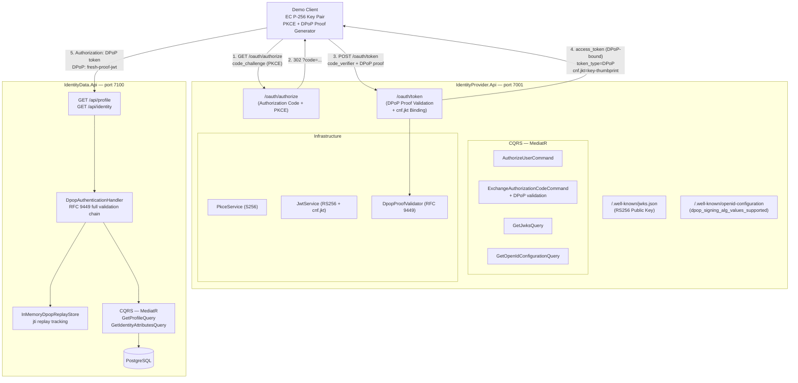

# Secure Identity & Trusted Data API

[](https://dotnet.microsoft.com/)
[](https://learn.microsoft.com/en-us/dotnet/csharp/)
[](LICENSE)

---

## ⚠️ Important Disclaimer

> **This is an independent educational Proof of Concept.**
>
> All users and identity data are entirely fictional test data. This project exists solely to demonstrate secure software engineering patterns using C# and .NET 10.

---

## Project Overview

This portfolio POC demonstrates enterprise-grade identity and API security patterns using modern C# / .NET 10:

| Concept | Implementation |
|---|---|
| OAuth 2.1 Authorization Code flow | `/oauth/authorize` → redirect with code |
| PKCE (S256) | RFC 7636 — `plain` method rejected |
| JWT access tokens | RS256, 15-minute TTL, `jti`, `kid` |
| RSA asymmetric signing | 2048-bit key, public-only JWK exposure |
| JWK / JWKS endpoint | `/.well-known/jwks.json` |
| OpenID-style discovery | `/.well-known/openid-configuration` |
| **DPoP sender-constrained tokens** | **RFC 9449 — token bound to client key pair** |
| **EC P-256 key pair / ES256** | **ECDSA, smaller keys, proof signed per-request** |
| **JWK Thumbprint (RFC 7638)** | **Stable key fingerprint embedded in access token** |
| **cnf.jkt key binding** | **Access token bound to client public key** |
| **JTI replay protection** | **Single-use DPoP proofs tracked in replay store** |
| **DPoP proof validation chain** | **typ · alg · sig · htm · htu · iat · ath · jti · cnf.jkt** |
| Protected Resource API | `IdentityData.Api` — PostgreSQL-backed identity data |
| CQRS with MediatR | Commands + Queries + pipeline behaviors |
| Clean Architecture | Domain → Application → Infrastructure → API |
| Validation pipeline | FluentValidation via MediatR behavior |
| Structured logging | Serilog — tokens never logged |
| Security-first design | Single-use codes, exact redirect URI match |
| Docker Compose | Both APIs + PostgreSQL in one command |

---

## Architecture



---

## Phase 1 — Identity Provider

### OAuth 2.1 Authorization Code Flow

The client sends the user to the authorization endpoint with a `code_challenge`. On successful authorization, the server issues a one-time authorization code bound to:
- the `client_id`
- the `redirect_uri` (exact match only)
- the `code_challenge`

The client then exchanges the code for a token by proving possession of the original `code_verifier`.

### PKCE — Proof Key for Code Exchange (RFC 7636)

Prevents authorization code interception attacks. The S256 method:

```
code_verifier  = cryptographically random 43–128 char string
code_challenge = BASE64URL(SHA256(ASCII(code_verifier)))
```

Only the `code_challenge` travels in the authorization request. The `code_verifier` is only sent at the token exchange step and is never stored on the server. The `plain` method is explicitly rejected.

### JWT Access Tokens

Access tokens are RS256-signed JSON Web Tokens with:
- `iss` — issuer URL
- `sub` — user identifier
- `aud` — intended API audience
- `scope` — granted scopes
- `jti` — unique token ID
- `exp` — expiry (15 minutes)
- `kid` — key ID to locate the correct public key
- `cnf.jkt` — JWK thumbprint of the client's DPoP public key (Phase 3)

### RSA Signing and JWK

The identity provider generates a 2048-bit RSA key pair at startup. JWT tokens are signed with the **private key**. Token consumers verify signatures using the **public key** from `/.well-known/jwks.json`. The private key is never exposed.

> **Production note:** In production, the RSA private key would be stored in AWS KMS / Secrets Manager and never loaded into application memory as raw bytes.

### Authorization Code Security

- 256-bit cryptographically random codes
- 2-minute TTL
- Single-use enforcement (replay detection removes the code)
- Bound to `client_id`, `redirect_uri`, and `code_challenge`

---

## Phase 2 — Protected Resource API

`IdentityData.Api` is a separately deployed API that serves sensitive identity data from PostgreSQL. It is protected by JWT bearer authentication and (in Phase 3) DPoP sender-constraint.

The API exposes two endpoints:
- `GET /api/profile` — basic profile (name, email, phone)
- `GET /api/identity` — extended identity attributes

Both require a valid DPoP-bound access token with the correct `scope`. The API uses the same Clean Architecture and CQRS patterns as the Identity Provider.

---

## Phase 3 — DPoP Sender-Constrained Tokens

DPoP (RFC 9449) upgrades the access tokens from plain Bearer tokens to *sender-constrained* tokens that are cryptographically bound to the client's key pair. **Even if an attacker steals the access token, they cannot use it without the corresponding private key.**

### Bearer vs DPoP

| | Bearer Token | DPoP Token |
|---|---|---|
| Token type | `Bearer` | `DPoP` |
| Key binding | None | `cnf.jkt` (JWK thumbprint) |
| Per-request proof | None | DPoP proof JWT (signed with private key) |
| Token theft risk | High | Low — token alone is worthless |

### How it works

1. The client generates an EC P-256 key pair. The private key never leaves the client.
2. At the token endpoint, the client sends a DPoP proof signed with the private key. The authorization server embeds the public key's thumbprint (`cnf.jkt`) in the access token.
3. On every API request, the client sends `Authorization: DPoP <token>` plus a fresh `DPoP: <proof>` header.
4. The resource server validates the complete RFC 9449 chain: proof signature, HTTP method binding, URI binding, timestamp, access token hash, JTI uniqueness, and `cnf.jkt` matching.

For full technical detail, see [`docs/phase-3.md`](docs/phase-3.md).

---

## CQRS Design

Commands and Queries are separated using MediatR across both APIs:

**IdentityProvider.Api**

| Type | Handler | Side Effect |
|---|---|---|
| `AuthorizeUserCommand` | `AuthorizeUserCommandHandler` | Generates + stores authorization code |
| `ExchangeAuthorizationCodeCommand` | `ExchangeAuthorizationCodeCommandHandler` | Validates PKCE + DPoP, issues DPoP-bound JWT |
| `GetJwksQuery` | `GetJwksQueryHandler` | None — reads public key |
| `GetOpenIdConfigurationQuery` | `GetOpenIdConfigurationQueryHandler` | None — reads config |

**IdentityData.Api**

| Type | Handler | Side Effect |
|---|---|---|
| `GetProfileQuery` | `GetProfileQueryHandler` | None — reads profile from PostgreSQL |
| `GetIdentityAttributesQuery` | `GetIdentityAttributesQueryHandler` | None — reads identity data from PostgreSQL |

A `ValidationBehavior<TRequest, TResponse>` MediatR pipeline behavior runs all FluentValidation validators before any handler executes.

---

## Project Structure

```
secure-identity-data-poc/
├── src/
│   ├── IdentityProvider.Api/       # OAuth 2.1 Authorization Server
│   │   ├── Features/               # CQRS — Commands and Queries
│   │   │   ├── Authorization/
│   │   │   ├── Token/
│   │   │   └── Discovery/
│   │   ├── Domain/                 # Entities, Exceptions
│   │   ├── Infrastructure/         # PKCE, JWT, RSA, DPoP, In-memory stores
│   │   │   └── DPoP/               # DpopProofValidator, DpopOptions, models
│   │   ├── Common/                 # Behaviors, Middleware, Extensions
│   │   └── Controllers/
│   └── IdentityData.Api/           # Protected Resource Server
│       ├── Application/Features/   # GetProfile, GetIdentityAttributes
│       ├── Domain/                 # Entities
│       ├── Infrastructure/
│       │   ├── Authentication/     # DpopAuthenticationHandler (RFC 9449)
│       │   ├── DPoP/               # IDpopReplayStore, InMemoryDpopReplayStore
│       │   └── Persistence/        # EF Core, PostgreSQL
│       └── Controllers/
├── tests/
│   ├── IdentityProvider.UnitTests/      # PKCE, JWT, DPoP issuance, domain
│   ├── IdentityProvider.IntegrationTests/ # Full OAuth + DPoP token endpoint
│   ├── IdentityData.UnitTests/          # DPoP validation, replay store, ath
│   └── IdentityData.IntegrationTests/   # HTTP DPoP validation, replay attack
├── docker-compose.yml
├── docker-compose.override.yml
├── .env.example
└── docs/
    ├── architecture.md             # Phase 1 architecture detail
    └── phase-3.md                  # DPoP deep-dive (RFC 9449)
```

---

## Local Development

### Prerequisites

- [.NET 10 SDK](https://dotnet.microsoft.com/download/dotnet/10.0)
- Docker (for Docker Compose setup) — or a local PostgreSQL instance

### Clone and Build

```bash
git clone https://github.com/your-username/secure-identity-data-poc.git
cd secure-identity-data-poc
dotnet restore
dotnet build
```

### Run with Docker Compose (recommended)

```bash
cp .env.example .env
# Edit .env and set POSTGRES_PASSWORD
docker-compose up
```

Both APIs and PostgreSQL start automatically.

### Run without Docker

```bash
# Terminal 1 — Identity Provider
dotnet run --project src/IdentityProvider.Api
# → https://localhost:7001

# Terminal 2 — Identity Data API (requires PostgreSQL)
dotnet run --project src/IdentityData.Api
# → https://localhost:7100
```

### Run Tests

```bash
# All tests
dotnet test SecureIdentityData.slnx

# Individual suites
dotnet test tests/IdentityProvider.UnitTests
dotnet test tests/IdentityData.UnitTests
dotnet test tests/IdentityProvider.IntegrationTests
dotnet test tests/IdentityData.IntegrationTests
```

---

## API Flow — End-to-End Example

### Step 1 — Generate PKCE pair and EC key pair (client-side)

```bash
# Generate code_verifier
CODE_VERIFIER="dBjftJeZ4CVP-mB92K27uhbUJU1p1r_wW1gFWFOEjXk"

# Compute S256 challenge
CODE_CHALLENGE=$(echo -n "$CODE_VERIFIER" | sha256sum | xxd -r -p | base64 | tr -d '=' | tr '+/' '-_')

# Generate EC P-256 key pair (client-side, private key never transmitted)
openssl ecparam -genkey -name prime256v1 -noout -out ec-private.pem
openssl ec -in ec-private.pem -pubout -out ec-public.pem
```

### Step 2 — Authorization Request

```http
GET /oauth/authorize
  ?client_id=secure-demo-client
  &redirect_uri=https://localhost:3000/callback
  &response_type=code
  &scope=openid%20profile
  &state=random-state-value
  &code_challenge=<CODE_CHALLENGE>
  &code_challenge_method=S256
```

**Response:** `302` redirect to `https://localhost:3000/callback?code=<AUTH_CODE>&state=random-state-value`

### Step 3 — Token Exchange (with DPoP proof)

```http
POST /oauth/token
Content-Type: application/x-www-form-urlencoded
DPoP: <dpop-proof-jwt>

grant_type=authorization_code
&code=<AUTH_CODE>
&redirect_uri=https://localhost:3000/callback
&client_id=secure-demo-client
&code_verifier=<CODE_VERIFIER>
```

**Response:**

```json
{
  "access_token": "eyJhbGciOiJSUzI1NiIsInR5cCI6IkpXVCIsImtpZCI6Ii4uLiJ9...",
  "token_type": "DPoP",
  "expires_in": 900,
  "scope": "openid profile"
}
```

The access token now contains a `cnf.jkt` claim with the JWK thumbprint of the client's EC public key.

### Step 4 — Access Protected Resource (with DPoP proof)

```http
GET /api/profile HTTP/1.1
Host: localhost:7100
Authorization: DPoP eyJhbGciOiJSUzI1NiIsInR5cCI6IkpXVCIsImtpZCI6Ii4uLiJ9...
DPoP: eyJhbGciOiJFUzI1NiIsInR5cCI6ImRwb3ArandsIiwiandrIjp7Li4ufX0...
```

The DPoP proof in the second header includes:
- `htm: "GET"` — HTTP method binding
- `htu: "https://localhost:7100/api/profile"` — URI binding
- `ath` — SHA-256 of the access token string
- `jti` — unique UUID for replay detection

---

## Demo Client

```
client_id:    secure-demo-client
client_name:  Secure Identity Demo Client
redirect_uri: https://localhost:3000/callback
scopes:       openid, profile
model:        Public client (no client_secret — PKCE provides proof-of-possession at auth code exchange)
```

## Demo User

```
user_id: user-001
name:    Demo User
email:   demo@example.test
```

All data is fictional test data.

---

## Phase Roadmap

| Phase | Status | Description |
|---|---|---|
| **1** | ✅ Complete | Identity Provider — OAuth 2.1, PKCE, RS256 JWT |
| **2** | ✅ Complete | Protected Identity Data API — CQRS, PostgreSQL, JWT validation |
| **3** | ✅ Complete | DPoP sender-constrained tokens — RFC 9449, EC P-256, cnf.jkt, replay protection |
| **4** | 🔜 Planned | Next.js / React client |
| **5** | 🔜 Planned | AWS deployment + Supabase + production infrastructure |

---

## License

MIT
