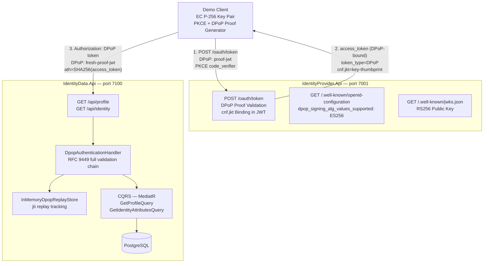
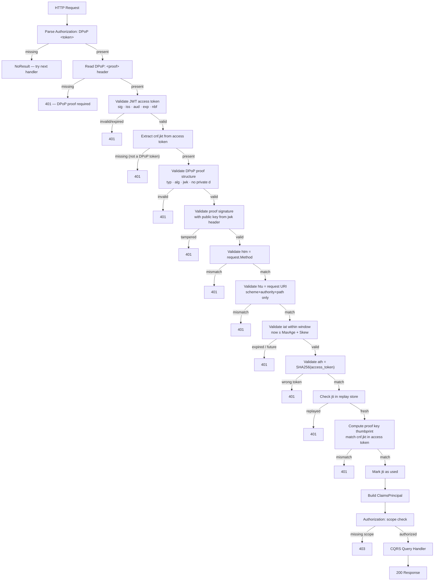

# Phase 3 — DPoP Sender-Constrained Access Tokens

## Introduction

Phase 3 adds **DPoP (Demonstrating Proof of Possession)** to the existing OAuth 2.1 foundation built in Phases 1 and 2. DPoP is a security mechanism standardised in [RFC 9449](https://www.rfc-editor.org/rfc/rfc9449) that upgrades access tokens from plain Bearer tokens to *sender-constrained* tokens: a token that is cryptographically bound to the client that requested it.

Phase 2 added a protected Identity Data API (`IdentityData.Api`) that validates RS256-signed JWT access tokens issued by the Identity Provider. Phase 3 strengthens this by requiring every request to that API to carry an additional DPoP proof JWT, signed with an EC private key that the client never transmits.

---

## What is DPoP?

### The Bearer Token Problem

A standard OAuth Bearer token (RFC 6750) acts like a hotel key card: whoever holds it can use it. If an attacker intercepts the token — through a compromised proxy, a leaked log, or a man-in-the-middle on an insecure connection — they can replay it from any client, anywhere in the world, until it expires.

### The DPoP Solution

DPoP (RFC 9449) binds the access token to a public/private key pair that the client generates and keeps. The flow works as follows:

1. The client generates an EC key pair (public + private). The private key never leaves the client.
2. When requesting an access token, the client presents a **DPoP proof JWT** signed with the private key. The authorization server embeds the client's public key fingerprint (`cnf.jkt`) into the issued access token.
3. On every protected API request, the client presents **both** the access token and a fresh DPoP proof JWT. The resource server validates that the proof was signed by the key whose thumbprint is embedded in the token.

The critical insight: **even if an attacker steals the access token, they cannot use it** — they would also need the private key to generate valid DPoP proofs.

---

## Bearer Token vs DPoP Token

| Property | Bearer Token | DPoP Token |
|---|---|---|
| Token type header | `Bearer` | `DPoP` |
| Key binding | None | `cnf.jkt` (JWK thumbprint) |
| Per-request proof | None | Required (DPoP proof JWT) |
| Replay protection | None beyond TLS | `jti` replay store |
| Token theft risk | High — token alone is sufficient | Low — token alone is insufficient |
| Implementation complexity | Low | Higher |
| RFC | RFC 6750 | RFC 9449 |

---

## Architecture



---

## DPoP Key Pair

This implementation uses **EC P-256** (NIST P-256 / secp256r1):

- Algorithm: `ES256` (ECDSA with SHA-256)
- Key size: 256-bit elliptic curve (equivalent strength to ~3072-bit RSA)
- Private key: never transmitted, never logged, used only to sign proofs
- Public key: represented as a JWK (`kty`, `crv`, `x`, `y`), embedded in every DPoP proof header

EC keys were chosen over RSA for DPoP because they produce smaller proofs, are faster to sign, and are widely supported across JWT libraries.

The public key that appears in the DPoP proof header contains only the key type and coordinates — no private key parameter `d` may be present. The validator rejects any proof whose header JWK contains `d`.

---

## DPoP Proof JWT

A DPoP proof is a short-lived, single-use JWT that demonstrates the client possesses the private key corresponding to the public key that is bound to the access token. It is sent in the `DPoP` HTTP header on every request.

### Structure

**Header:**

```json
{
  "typ": "dpop+jwt",
  "alg": "ES256",
  "jwk": {
    "kty": "EC",
    "crv": "P-256",
    "x": "f83OJ3D2xF1Bg8vub9tLe1gHMzV76e8Tus9uPHvRVEU",
    "y": "x_FEzRu9m36HLN_tue659LNpXW6pCyStikYjKIWI5a0"
  }
}
```

**Payload:**

```json
{
  "jti": "7535b94e-9fe0-4f80-b2a4-6e6d86ffd8f2",
  "htm": "GET",
  "htu": "https://localhost:7100/api/profile",
  "iat": 1700000000,
  "ath": "fUHyO2r2Z3DZ53EsNrWX9b57szu7GmgaTR7rU3ljZYc"
}
```

### Claim Definitions

| Claim | Location | Description |
|---|---|---|
| `typ` | Header | Must be exactly `dpop+jwt` |
| `alg` | Header | Must be in the allowed list (`ES256`) |
| `jwk` | Header | Client's public key as JWK (no private `d` parameter) |
| `jti` | Payload | Unique UUID — used for replay detection |
| `htm` | Payload | HTTP method in uppercase (`GET`, `POST`, …) |
| `htu` | Payload | Target URI (scheme + authority + path, no query or fragment) |
| `iat` | Payload | Unix timestamp (seconds) when the proof was created |
| `ath` | Payload | `Base64URL(SHA-256(access_token_string))` — binds proof to a specific token |

The `ath` claim is only required at resource server requests (not at the token endpoint, where no access token exists yet).

---

## JWK Thumbprint — cnf.jkt (RFC 7638)

When the authorization server issues a DPoP-bound access token, it embeds the client's public key fingerprint in the `cnf.jkt` claim. The thumbprint is computed per **RFC 7638**:

1. Build a JSON object containing only the required members for the key type, in **lexicographic order**: for EC keys this is `{"crv":"P-256","kty":"EC","x":"...","y":"..."}`.
2. Serialize without whitespace.
3. Compute `SHA-256` of the UTF-8 bytes.
4. Encode as `Base64URL` (no padding).

This produces a stable, compact, 43-character identifier for the public key. Every DPoP proof presented to the resource server must carry a public key whose computed thumbprint matches the `cnf.jkt` in the access token. If they differ, the token was issued to a different key and the request is rejected.

---

## Access Token Hash — ath

The `ath` claim in the DPoP proof binds the proof to a specific access token:

```
ath = Base64URL(SHA-256(ASCII(raw_access_token_string)))
```

Without `ath`, an attacker who obtains a valid DPoP proof (e.g. by capturing one request) could potentially pair it with a different access token. The `ath` claim prevents this: the proof is cryptographically tied to the exact token string.

The resource server recomputes `ath` from the access token it received and compares it to the `ath` claim in the proof using a constant-time equality check. Any mismatch results in a `401`.

---

## HTTP Method Binding — htm

The `htm` claim records the HTTP method the proof was created for. The validator compares it (case-insensitively) against the actual method of the incoming request.

This prevents proof reuse across methods. A proof created for `GET /api/profile` cannot be used for `POST /api/profile`, even if the URI and access token are identical.

---

## URI Binding — htu

The `htu` claim records the target URI the proof was created for. Per RFC 9449 §4.3, only the **scheme**, **authority**, and **path** are compared — query strings and fragments are excluded.

```
https://localhost:7100/api/profile?query=x  →  https://localhost:7100/api/profile
```

This prevents proof reuse across endpoints. A proof created for `/api/profile` cannot be used for `/api/identity`.

The implementation normalises both the proof `htu` and the expected URI to `scheme://authority/path` (trailing slashes stripped) before comparison.

---

## Timestamp Validation — iat

Every DPoP proof has an `iat` (issued-at) Unix timestamp. The validator checks:

```
now - MaximumAgeSeconds - ClockSkewSeconds  ≤  iat  ≤  now + ClockSkewSeconds
```

Default configuration (both APIs):

| Setting | Default | Meaning |
|---|---|---|
| `Dpop:MaximumAgeSeconds` | `300` | Proof must not be older than 5 minutes |
| `Dpop:ClockSkewSeconds` | `60` | Allow 60 seconds of clock difference |

Old proofs are rejected outright. A proof created an hour ago — even if never used — is invalid.

---

## JTI Replay Protection

Each DPoP proof carries a `jti` (JWT ID) that must be a unique UUID. The resource server:

1. Checks whether the `jti` has been seen before (within its expiry window).
2. If yes → `401 invalid_token` (replay attack detected).
3. If no → marks the `jti` as used with expiry `iat + MaximumAgeSeconds + ClockSkewSeconds`.
4. Proceeds with the rest of validation.

### IDpopReplayStore Interface

```csharp
public interface IDpopReplayStore
{
    Task<bool> HasBeenUsedAsync(string jti, CancellationToken ct = default);
    Task MarkAsUsedAsync(string jti, DateTimeOffset expiry, CancellationToken ct = default);
}
```

The current implementation (`InMemoryDpopReplayStore`) uses a `ConcurrentDictionary` with lazy expiry pruning. This is suitable for single-instance development.

> **Production limitation:** The in-memory replay store only works within a single process instance. For horizontally scaled deployments, replace `InMemoryDpopReplayStore` with a distributed implementation (Redis, PostgreSQL) behind the same `IDpopReplayStore` interface — no changes to validation logic required.

---

## HTTP Request Format

A request to the Identity Data API requires both the DPoP-bound access token and a fresh DPoP proof:

```http
GET /api/profile HTTP/1.1
Host: localhost:7100
Authorization: DPoP eyJhbGciOiJSUzI1NiIsInR5cCI6IkpXVCIsImtpZCI6Ii4uLiJ9...
DPoP: eyJhbGciOiJFUzI1NiIsInR5cCI6ImRwb3ArandsIiwiandrIjp7Li4ufX0...
```

The access token is carried in the `Authorization` header with the scheme `DPoP` (not `Bearer`). The DPoP proof is a separate JWT in the `DPoP` header.

---

## DPoP Validation Chain

The complete validation performed by `DpopAuthenticationHandler` on every request:



---

## Security Improvement: DPoP vs Bearer

### Attack Scenario

Consider an attacker who intercepts a valid access token from a network request.

**With a Bearer token:**
1. Attacker captures the token string.
2. Attacker sends `Authorization: Bearer <stolen-token>` to the API.
3. Request succeeds. The API has no way to distinguish the legitimate client from the attacker.

**With a DPoP-bound token:**
1. Attacker captures the token string.
2. Attacker sends `Authorization: DPoP <stolen-token>` — but they have no DPoP proof.
3. Request fails immediately: `401 — DPoP proof required`.
4. Attacker constructs a DPoP proof — but they do not have the client's private key, so the signature is invalid.
5. All attempts fail. The access token is worthless without the private key.

The private key is the additional factor. Even a perfect copy of the token is insufficient.

---

## Local Setup

### Prerequisites

- [.NET 10 SDK](https://dotnet.microsoft.com/download/dotnet/10.0)
- PostgreSQL (for `IdentityData.Api`) — or Docker

### Option A: Docker Compose (recommended)

```bash
cp .env.example .env
# Edit .env and set POSTGRES_PASSWORD to a value of your choice
docker-compose up
```

This starts both APIs and PostgreSQL with the correct ports and environment variables.

### Option B: dotnet run (requires local PostgreSQL)

```bash
# Terminal 1
cd src/IdentityProvider.Api
dotnet run

# Terminal 2
cd src/IdentityData.Api
dotnet run
```

Ensure PostgreSQL is running and the connection string in `src/IdentityData.Api/appsettings.json` points to your instance.

### Endpoints

**IdentityProvider.Api** — `https://localhost:7001`

| Endpoint | Description |
|---|---|
| `GET /.well-known/openid-configuration` | Discovery document — includes `dpop_signing_alg_values_supported` |
| `GET /.well-known/jwks.json` | RS256 public key for access token verification |
| `GET /oauth/authorize` | Authorization Code + PKCE endpoint |
| `POST /oauth/token` | Token exchange — requires DPoP proof |
| `GET /swagger` | OpenAPI UI |

**IdentityData.Api** — `https://localhost:7100`

| Endpoint | Description |
|---|---|
| `GET /api/profile` | Returns profile data — requires DPoP-bound access token |
| `GET /api/identity` | Returns identity attributes — requires DPoP-bound access token |
| `GET /swagger` | OpenAPI UI |

---

## Running Tests

```bash
# All tests
dotnet test SecureIdentityData.slnx

# Individual project
dotnet test tests/IdentityProvider.UnitTests
dotnet test tests/IdentityData.UnitTests
dotnet test tests/IdentityProvider.IntegrationTests
dotnet test tests/IdentityData.IntegrationTests
```

### Test Coverage

| Project | What is tested |
|---|---|
| `IdentityProvider.UnitTests` | OAuth flow, PKCE validation, JWT issuance, DPoP proof validation at token endpoint, `cnf.jkt` binding |
| `IdentityData.UnitTests` | DPoP proof validation, `ath` computation, `htm`/`htu` binding, timestamp window, replay store |
| `IdentityProvider.IntegrationTests` | Full Authorization Code + PKCE + DPoP token endpoint flow |
| `IdentityData.IntegrationTests` | HTTP-level DPoP validation, end-to-end access with DPoP token, replay attack scenario |

---

## Configuration Reference

### IdentityProvider.Api — `appsettings.json`

```json
{
  "IdentityProvider": {
    "Issuer": "https://localhost:7001",
    "Audience": "secure-identity-data-api",
    "AccessTokenLifetimeSeconds": 900
  },
  "Dpop": {
    "Enabled": true,
    "SigningAlgorithms": ["ES256"],
    "MaximumAgeSeconds": 300,
    "ClockSkewSeconds": 60,
    "ReplayProtectionEnabled": true
  }
}
```

### IdentityData.Api — `appsettings.json`

```json
{
  "IdentityData": {
    "JwksUri": "https://localhost:7001/.well-known/jwks.json",
    "ValidIssuer": "https://localhost:7001",
    "ValidAudience": "secure-identity-data-api"
  },
  "ConnectionStrings": {
    "DefaultConnection": "Host=localhost;Database=identity_data;Username=postgres;Password=..."
  },
  "Dpop": {
    "Enabled": true,
    "SigningAlgorithms": ["ES256"],
    "MaximumAgeSeconds": 300,
    "ClockSkewSeconds": 60,
    "ReplayProtectionEnabled": true
  }
}
```

---

## Security Limitations

This is an educational proof of concept. The following limitations apply:

| | |
|---|---|
| ✅ | Protects against token forwarding and replay from a different client |
| ✅ | Requires attacker to have both the access token AND the matching private key |
| ✅ | `ath` prevents pairing a valid DPoP proof with a different access token |
| ✅ | `htm` / `htu` binding prevents cross-endpoint and cross-method proof reuse |
| ⚠️ | Does not protect against XSS if both the token and the private key are accessible to attacker-controlled script in the same browser context |
| ⚠️ | `InMemoryDpopReplayStore` is not suitable for multi-instance deployment — replace with Redis or a database-backed implementation |
| ⚠️ | The RSA signing key in `IdentityProvider.Api` is generated in-memory at startup — ephemeral, rotated on restart, not suitable for production |
| ⚠️ | HTTPS is still required — DPoP does not replace TLS; it only adds sender-constraint on top of it |
| ⚠️ | All user and identity data is fictional test data — not connected to any real identity system |

---

## Related Documents

- [`docs/architecture.md`](architecture.md) — Phase 1 clean architecture and CQRS design
- [`README.md`](../README.md) — Project overview and quick-start
- [RFC 9449 — OAuth 2.0 Demonstrating Proof of Possession](https://www.rfc-editor.org/rfc/rfc9449)
- [RFC 7638 — JSON Web Key (JWK) Thumbprint](https://www.rfc-editor.org/rfc/rfc7638)
- [RFC 7636 — PKCE](https://www.rfc-editor.org/rfc/rfc7636)
